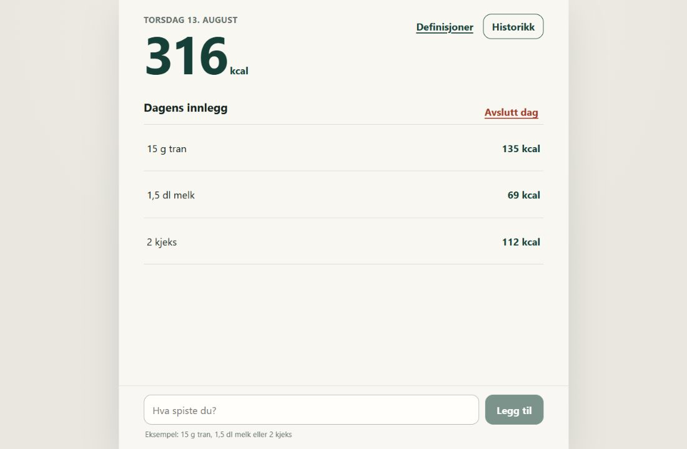

# Kaloriteller

[](https://rolfss.github.io/kaloriteller_nettleser_og_android_app/)
[](https://rolfss.github.io/kaloriteller_nettleser_og_android_app/?demo=1)
[](https://github.com/rolfss/kaloriteller_nettleser_og_android_app/actions/workflows/quality-and-deploy.yml)
[](https://rolfss.github.io/kaloriteller_nettleser_og_android_app/)
[](./android)
[](https://github.com/rolfss/kaloriteller_nettleser_og_android_app/releases/download/v1.1.0/kaloriteller-android-test.apk)

**A privacy-first calorie logger that learns only the calorie rules the user explicitly provides. No accounts, backend, analytics, external food database, or calorie guessing.**

> [Try a private recruiter demo](https://rolfss.github.io/kaloriteller_nettleser_og_android_app/?demo=1) — it runs entirely in memory and clears itself on reload or close.

> [Try the application in your browser](https://rolfss.github.io/kaloriteller_nettleser_og_android_app/) — it is installable and continues to work offline after the first load.



## Why this project is interesting

Kaloriteller turns a deceptively small product idea into a carefully constrained local-first application. A user can enter `15 g tran`, `1,5 dl melk`, or `3 flasker`. If the required calorie rule is unknown, the application asks for an explicit definition and reuses it later. It never infers nutrition, density, unit conversions, or fuzzy matches.

The implementation demonstrates:

- deterministic domain parsing separated from React and platform APIs;
- versioned IndexedDB persistence behind a typed application-service boundary;
- transactional day completion, child cleanup, and seven-day retention;
- immutable historical calorie-rate snapshots;
- explicit custom-unit aliases with collision prevention;
- locally generated PDFs with browser and Android save/share adapters;
- versioned JSON backup/import, safe CSV export, and explicit local-data deletion;
- isolated recruiter demo sessions and automatic fallback when browser storage is blocked;
- undoable destructive edits and an export-first warning before seven-day retention removes a day;
- an installable offline PWA and a shared Capacitor Android codebase;
- strict TypeScript, runtime validation, accessibility, and behavior-focused tests.

## Product capabilities

| Area | Behavior |
|---|---|
| Entry formats | Gram, deciliter, decimal comma/point, and arbitrary count units |
| Learning | User-supplied kcal rules only; exact deterministic reuse |
| Active day | Derived total, edit/delete, explicit completion, remains open across midnight |
| History | Seven newest completed days; completed entries remain editable |
| Integrity | Definition corrections affect future calculations, not saved history |
| Export | Local PDF for one day or all retained days |
| Privacy | On-device data, no account/backend/telemetry, no Android network permission |
| Platforms | Chrome/PWA and Android through Capacitor |
| Restricted computers | Automatic in-memory session if persistent browser storage is blocked |
| Recruiter demo | `?demo=1` always uses a fresh, isolated in-memory session |
| Portability | Transactional JSON backup/import plus local CSV and PDF export |
| Safety | Ten-second undo and explicit warning before retention removes the oldest day |

## Architecture

```text
React features/components
        │
Application services ─── PDF document builder
        │                       │
Pure domain rules        Platform save adapter
        │                 (browser / Android)
Typed Dexie repository
        │
IndexedDB — canonical local state
```

The total is always derived from entry snapshots. Persistent state is read back after mutations instead of being duplicated in a large client-side store. See [ARCHITECTURE.md](./ARCHITECTURE.md), [DOMAIN_MODEL.md](./DOMAIN_MODEL.md), and the [decision log](./docs/AGENT_DECISIONS.md).

## Run without installation

The [live application](https://rolfss.github.io/kaloriteller_nettleser_og_android_app/) runs directly in the browser. It does not create project files or require an account. It normally uses versioned IndexedDB, which is internal browser storage rather than a user-created file. If a managed browser blocks IndexedDB, the same application automatically runs in memory until the page reloads or closes and clearly marks the data as temporary.

For evaluation, use the dedicated [recruiter demo](https://rolfss.github.io/kaloriteller_nettleser_og_android_app/?demo=1). It deliberately skips persistent storage even when available, never reads an evaluator's regular app data, and resets on reload.

## Run locally

Requirements: Node.js 20.19+, 22.12+, or newer, and pnpm 11.16.

```bash
pnpm install
pnpm dev
```

Then open `http://localhost:5173`.

## Verify and build

```bash
pnpm typecheck
pnpm lint
pnpm test
pnpm build
```

The production build creates the web application, manifest, and service worker in `dist/`. The current automated suite covers parsing, validation, measured/custom calculations, aliases, definition reuse, historical snapshots, midnight behavior, retention, persistence, UI behavior, and PDF construction.

Detailed verification evidence is recorded in [docs/ACCEPTANCE_RESULTS.md](./docs/ACCEPTANCE_RESULTS.md).

## Android

**For evaluators:** [download the installable Android APK](https://github.com/rolfss/kaloriteller_nettleser_og_android_app/releases/download/v1.1.0/kaloriteller-android-test.apk), or open the [live app](https://rolfss.github.io/kaloriteller_nettleser_og_android_app/) in Chrome on Android and choose **Install app**. Both variants run locally, work offline, and store calorie data only on the device. The APK is a debug-signed test package, so Android may ask for permission to install from the browser.

```bash
pnpm build
pnpm cap:sync
pnpm android:assets
pnpm android
```

Direct debug build after configuring JDK 21 and Android SDK 36:

```powershell
cd android
.\gradlew.bat assembleDebug
```

PDF export writes a temporary file to the app-private cache only after an explicit export action, opens Android's native share/save flow, and removes the temporary file afterward. The Android manifest requests neither network nor broad storage access.

Tagged versions also build a debug-signed, installable recruiter APK in GitHub Actions and attach it to a clearly labeled prerelease. See [GitHub Releases](https://github.com/rolfss/kaloriteller_nettleser_og_android_app/releases). This test package is not a Play Store production build.

## Deployment

Every push to `main` runs typecheck, lint, tests, and a production build before GitHub Pages is updated. Pull requests run the same quality gate without publishing.

Tags matching `v*` additionally build the Android project with Java 21 and publish the debug APK as a test prerelease after the Android build succeeds.

---

Built from a product brief with explicit acceptance criteria, architecture boundaries, decision records, and a full verification report—not as a UI-only prototype.
